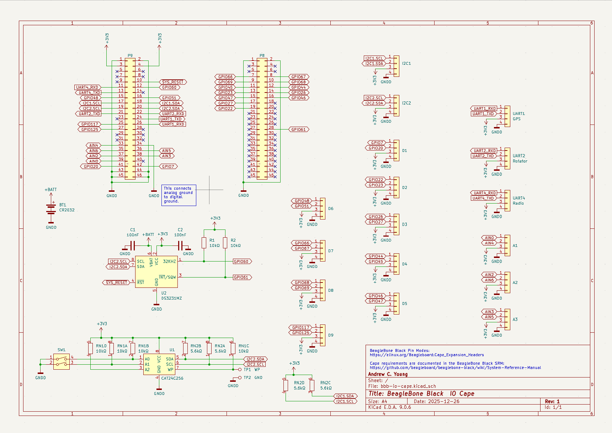
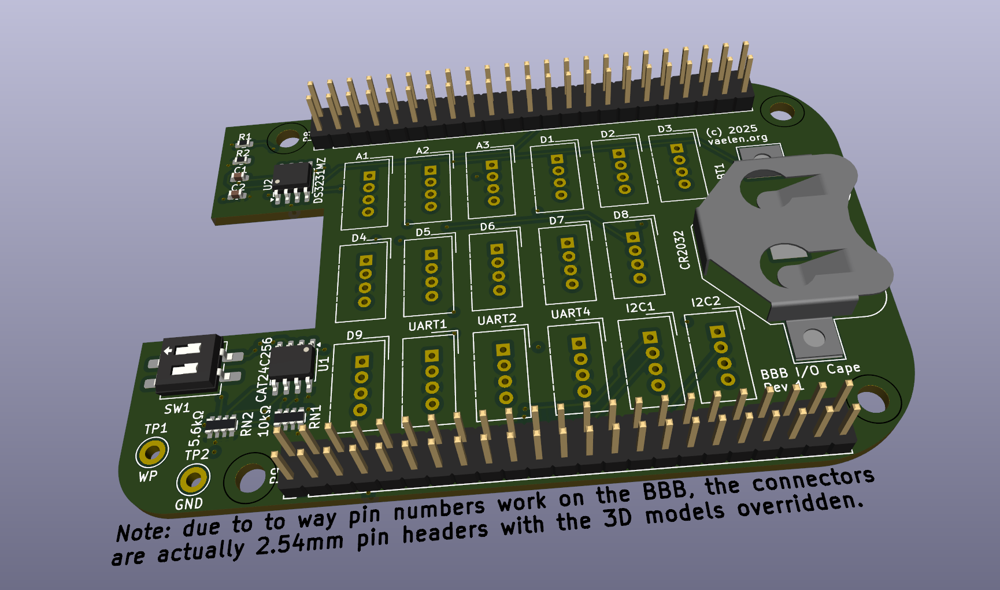

# BeagleBone Black I/O Cape

A KiCad-designed I/O expansion cape for the BeagleBone Black SBC, featuring Grove-compatible connectors for easy interfacing with sensors, actuators, and communication peripherals.

**NOTE: The design has not yet been verified, use at your own risk!**

 

## Features

| Interface | Connector Count | Notes                             |
|-----------|----------------:|-----------------------------------|
| Analog    |               3 | Grove 4-pin (A1, A2, A3)          |
| Digital   |               9 | Grove 4-pin (D1-D9)               |
| I2C       |               2 | Grove 4-pin (I2C1, I2C2)          |
| UART      |               3 | Grove 4-pin (UART1, UART2, UART4) |

### Onboard Components

- **DS3231MZ** - High-precision real-time clock with CR2032 battery backup
- **CAT24C256** - 256Kb I2C EEPROM for cape identification
- **2-position DIP switch** - Configuration options
- **Test points** - WP (write protect) and GND

## Pinout

The cape connects via the standard BeagleBone Black P8 and P9 expansion headers (2x23 pin, 2.54mm pitch).

### Connectors

| Connector | Pin 1   | Pin 2   | Function            |
|-----------|---------|---------|---------------------|
| UART1     | P9 / 26 | P9 / 24 | UART1 RX / TX       |dtc -@ -I dts -O dtb -o BB-IO-CAPE-00A0.dtbo BB-IO-CAPE-00A0.dts
| UART2     | P9 / 22 | P9 / 21 | UART2 RX / TX       |
| UART4     | P9 / 11 | P9 / 13 | UART4 RX / TX       |
| I2C1      | P9 / 17 | P9 / 18 | I2C1 SCL / SDA      |
| I2C2      | P9 / 19 | P9 / 20 | I2C2 SCL / SDA      |
| A1        | P9 / 39 | P9 / 33 | AIN 0 / AIN 4       |
| A2        | P9 / 37 | P9 / 35 | AIN 2 / AIN 6       |
| A3        | P9 / 38 | P9 / 36 | AIN 3 / AIN 5       |
| D1        | P9 / 42 | P9 / 41 | GPIO 07 / GPIO 116  |
| D2        | P8 / 19 | P8 / 13 | GPIO 22 / GPIO 23   |
| D3        | P8 / 14 | P8 / 17 | GPIO 26 / GPIO 27   |
| D4        | P8 / 12 | P8 / 11 | GPIO 44 / GPIO 45   |
| D5        | P8 / 16 | P8 / 15 | GPIO 46 / GPIO 47   |
| D6        | P9 / 15 | P9 / 16 | GPIO 48 / GPIO 51   |
| D7        | P8 / 7  | P8 / 8  | GPIO 66 / GPIO 67   |
| D8        | P8 / 10 | P8 / 9  | GPIO 68 / GPIO 69   |
| D9        | P9 / 25 | P9 / 27 | GPIO 117 / GPIO 115 |
| RTC       | P9 / 12 | P8 / 28 | GPIO 60 / GPIO 88   |

**Note:** All I/O signals are 3.3V. Do not apply 5V to any I/O pin.

## Real Time Clock

The real time clock is wired into the I2C2 bus as device 0x68.

## Device Tree Overlay

The cape includes a device tree overlay (`BB-IO-CAPE-00A0.dts`) that configures all peripherals for use under Linux.

The filename `BB-IO-CAPE-00A0` matches the part number (`BB-IO-CAPE`) and version (`00A0`) stored in the cape EEPROM, allowing U-Boot to automatically load the overlay at boot.

### Installing the Pre-compiled Overlay

A pre-compiled overlay (`BB-IO-CAPE-00A0.dtbo`) is included. To install on your BeagleBone:

```bash
# Copy the overlay to the firmware directory
sudo cp BB-IO-CAPE-00A0.dtbo /lib/firmware/
```

**Important:** The universal cape overlay and conflicting peripherals must be disabled to avoid pin conflicts. Edit `/boot/uEnv.txt` and make the following changes:

```bash
# Use the standard (non-universal) device tree
dtb=am335x-boneblack.dtb

# Comment out the universal cape enable
#enable_uboot_cape_universal=1

# Disable HDMI and audio (they conflict with GPIO pins)
disable_uboot_overlay_video=1
disable_uboot_overlay_audio=1
```

Then reboot for changes to take effect.

### Compiling from Source (Optional)

If you need to modify the overlay or compile it yourself:

```bash
# Preprocess and compile
cpp -nostdinc -I /usr/src/linux-headers-$(uname -r)/include \
    -undef -x assembler-with-cpp BB-IO-CAPE-00A0.dts | \
    dtc -@ -I dts -O dtb -o BB-IO-CAPE-00A0.dtbo -
```

### What the Overlay Configures

| Peripheral | Configuration                                     |
|------------|---------------------------------------------------|
| UART1      | P9.24 (TX), P9.26 (RX) - `/dev/ttyS1`             |
| UART2      | P9.21 (TX), P9.22 (RX) - `/dev/ttyS2`             |
| UART4      | P9.13 (TX), P9.11 (RX) - `/dev/ttyS4`             |
| I2C1       | P9.17 (SCL), P9.18 (SDA) - `/dev/i2c-1` @ 400kHz  |
| I2C2       | P9.19 (SCL), P9.20 (SDA) - `/dev/i2c-2` @ 400kHz  |
| ADC        | Channels 0, 2, 3, 4, 5, 6 enabled                 |
| DS3231 RTC | I2C2 @ 0x68 - `/dev/rtc1`                         |
| GPIO D1-D9 | 18 pins configured as outputs                     |
| RTC 32KHz  | GPIO 60 (P9.12) - 32KHz clock output              |
| RTC Alarm  | GPIO 88 (P8.28) - Alarm interrupt (active low)    |

### Verifying the Overlay

After loading the overlay, verify the devices are available:

```bash
# Check RTC
ls /dev/rtc*
hwclock -r -f /dev/rtc1

# Check I2C devices
i2cdetect -y -r 1   # I2C1 bus
i2cdetect -y -r 2   # I2C2 bus (should show RTC at 0x68)

# Check UARTs
ls /dev/ttyS*

# Check ADC values
cat /sys/bus/iio/devices/iio:device0/in_voltage0_raw
```

## Manufacturing

Production files (Gerbers, BOM, pick-and-place positions) can be generated using KiCad's fabrication toolkit or found in the `production/` directory.

### BOM Summary

| Component     | Value/Part   | Quantity |
|---------------|--------------|----------|
| Grove 4-pin   | Vertical     | 17       |
| EEPROM        | CAT24C256    | 1        |
| RTC           | DS3231MZ     | 1        |
| Battery       | CR2032       | 1        |
| DIP Switch    | 2-position   | 1        |
| Capacitors    | 100nF 0603   | 2        |
| Resistors     | 10kΩ 0603    | 2        |
| Resistor Array| 10kΩ 4x0603  | 1        |
| Resistor Array| 5.6kΩ 4x0603 | 1        |

## Requirements

- KiCad 8.0 or later
- BeagleBone Black (or compatible: BBB Wireless, BeagleBone AI, etc.)

## License

MIT License

Copyright (c) 2026, Andrew C. Young

Permission is hereby granted, free of charge, to any person obtaining a copy
of this software and associated documentation files (the "Software"), to deal
in the Software without restriction, including without limitation the rights
to use, copy, modify, merge, publish, distribute, sublicense, and/or sell
copies of the Software, and to permit persons to whom the Software is
furnished to do so, subject to the following conditions:

The above copyright notice and this permission notice shall be included in all
copies or substantial portions of the Software.

THE SOFTWARE IS PROVIDED "AS IS", WITHOUT WARRANTY OF ANY KIND, EXPRESS OR
IMPLIED, INCLUDING BUT NOT LIMITED TO THE WARRANTIES OF MERCHANTABILITY,
FITNESS FOR A PARTICULAR PURPOSE AND NONINFRINGEMENT. IN NO EVENT SHALL THE
AUTHORS OR COPYRIGHT HOLDERS BE LIABLE FOR ANY CLAIM, DAMAGES OR OTHER
LIABILITY, WHETHER IN AN ACTION OF CONTRACT, TORT OR OTHERWISE, ARISING FROM,
OUT OF OR IN CONNECTION WITH THE SOFTWARE OR THE USE OR OTHER DEALINGS IN THE
SOFTWARE.
